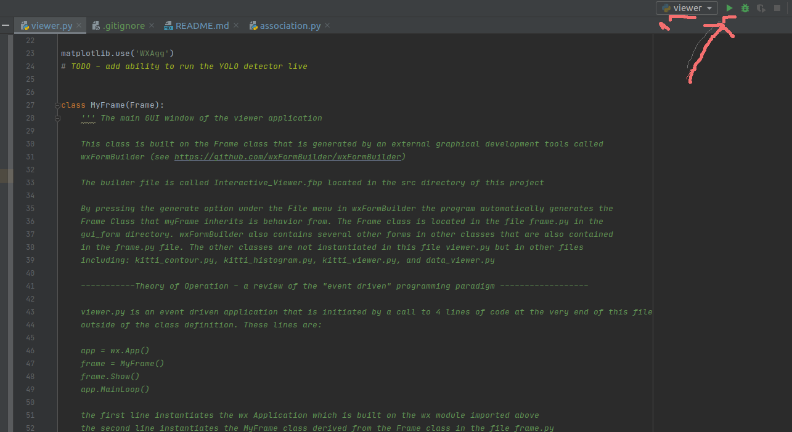

# viewer
Video Lidar Viewer

This viewer allows the user to view video and lidar data in an interactive GUI based system

## Running the Viewer
### Running in PyCharm
1. Navigate to [src/viewer.py](src/viewer.py)  
1. Click on Play button  

   
### Running from terminal
1. Navigate to root folder
1. Create/activate virtual environment and Install requirements.txt
```bash
python3 -m venv venv
source venv/bin/activate
```
1. Ensure the venv python is targeted
```bash
which python3
```
should output:
```bash
$(PWD)/venv/bin/python3
```
If system python is targeted, then force usage of venv python for this session
```bash
alias python3=$PWD/venv/bin/python3
```
Now install requirements
```bash
python3 -m pip install requirements.txt
```

1. Set the `PYTHONPATH` root dir as `$root_dir/src`
```bash
cd src/
export PYTHONPATH=$PWD
```
1. Run the viewer
```bash
python3 viewer.py
```
